仅工程目标，不服务论文主张。评测数据集视为临时，一切设计以可移植到 knowhere-main 为准。

## 1. 审计结论（融合前，全部有代码或数据支撑）

> §1 与 §2 是融合改造前的审计与设计，保留作为决策依据。改造后的实际落地情况、实测发现与后续修复见 §3~§6。

### 1.1 成本结构：贵在「调用次数 × 每次重塞地图」

从 `map_nav_trace/plan_nav_e2e_complex5_corpus_b20k/llm_api_cache.jsonl` 的 `usage` 字段离线算出（无新增 API 开销）：

- `nav_navigate_v1`：137 次调用，1,502,266 prompt token = **全部 prompt 的 88.6%**；单次中位 8089、最大 44034
- `nav_query_plan_v2`：10 次，32,987 token = 2.0%（planner 本身极便宜）
- `nav_slot_extract_v1`：25 次，72,713 token = 4.3%
- prompt 占总 token **98.6%**，completion 可忽略

分臂：planned 五题 1,159,461 prompt token / 138 次 API；baseline 五题 536,646 / 46 次。**3.0 倍调用、2.2 倍 token**。

### 1.2 浪费结构：一半的 NAV 调用只是在说「我收手了」

planned 五题 `nav_finish` 合计 **46 次**，占 planned 全部 nav 调用（95）的 **48%**；而 baseline 五题的 API 总数恰好也是 46。baseline 自身 FINISH 占比 26%。

`nav_subagent_v1` 在缓存里是 **0 次**。原因在 [src/nav/nav_navigate.py](src/nav/nav_navigate.py) 的 `dispatch()`：语料→文档根 DISPATCH 时 `child_depth = 0 if is_doc_root_section(rid)`。所以语料模式下几乎每个 navigate 都按 depth-0「外层 agent」跑，拿满 `max_steps=8`、拿到 assembled-evidence 预览、被要求给 `group_rank`。**depth 分层在语料模式下已经塌掉了。**

### 1.3 收益结构：没有收益

pack_recall（baseline → planned）：0.737→0.737、**0.429→0.619**、1.0→1.0、1.0→1.0、0.714→0.714。pool_recall 五题完全相同。**只有一题提升，其余持平，代价 3 倍调用。**

### 1.4 根因链（这是「两套检查机制打架」的具体形态）

1. `_verify_subgoal` 调 `build_evidence_text_from_state(state)`，返回**整个 state 的全部证据**，不是本 subgoal 新增的。`collected_before` 已算出来了，却只用于 `collected_section_ids`，没用于证据文本（[src/nav/nav_orchestrate.py](src/nav/nav_orchestrate.py) 第 178 行、第 195 行）。这与当初删掉 locality 合并的理由是同一类错误，只是换到了 wave 之间。
2. 判不满足 → 重试耗尽 → `_execute_subgoal_with_verdicts` 末尾**无条件升级 REPLAN**（只要 `max_replans>0` 且 verdict 属于重试族）。探针里 **5/5 题都触发了 replan**。
3. replan 清空 `satisfied/attempted/activated/slot_bindings/subgoal_results`，但**不清** `collected` 与 `collected_section_ids`。
4. `NAV_FILTER_COLLECTED_SECTIONS=1`（探针脚本第 22 行设置）下，`_build_map_tree` 把 collected 枝整枝从地图删除，`build_legal_actions` 同时从动作空间删除。所以重跑的 subgoal 看到一张被掏空的地图。
5. 于是每个重跑立刻 FINISH——但仍要付一次约 8K token 的全图 prompt。**FINISH 膨胀被完整解释。**

### 1.5 你的直觉被代码证实：PLAN 的路由信息被丢掉了

`route_hints` 在 [src/nav/nav_plan.py](src/nav/nav_plan.py) 里已经被 `_resolve_route_hints` 校验成**真实可见 section_id**，但唯一消费者是 [src/nav/nav_illuminate.py](src/nav/nav_illuminate.py) 的点亮加分。`_run_navigate_for_query` 永远传 `scope=None, depth=0`：

```python
navigate(ts, state=state, scope=None, query=query, config=config, depth=0, ...)
```

所以每个 subgoal 都要从 42 文档语料根重新 LLM 下潜一遍。**「PLAN 把一条 NAV 链变成多条 NAV 链」不是机制固有代价，是路由信息被扔了。**

### 1.6 四套重叠的「够不够」判断

- NAV 内层 FINISH：每个 navigate 循环一次 LLM，判据是提示词里的「evidence is sufficient, or irrelevant / exhausted」，无可检查条件（[src/nav/nav_policy.py](src/nav/nav_policy.py)）
- depth-0 的 `group_rank` 重排：每次 depth-0 navigate 只要 `state.collected` 非空就重新索要一次排序并**覆写** `state.group_priority`。plan 模式下每个 subgoal 都是 depth-0，所以**最后一个 subgoal 的排序赢得全局打包权**
- 子 agent 自由文本 `RegionReport` → `reports_context`：`_merge_nav_state` 无上限累加，plan 模式下**跨 subgoal 从不清空**，这是单次 prompt 冲到 44034 token 的直接来源
- PLAN 的 `verify_contract`：唯一有明确判据的一个，但输入是泄漏的全局证据，且决策权在硬编码阶梯而非 planner

四者互不通信。verifier 说「不满足」时，NAV 的 FINISH 早已说过「够了/耗尽了」，没有任何环节调和这两句话。`RETRY_SAME_REGION` 用同一个 query 从同一个根重跑，语义上必然是空操作。

### 1.7 移植依赖面（好消息）

`src/nav` 对 ToolSpace 的全部调用点收敛为 9 个。**必需 5 个，全部只关于层级与取文**：

- `get_structure(section_id)` — title / summary / n_chunks
- `_children_for_section_path(section_id)` — 子节点
- `sections_for_doc(doc_id)` — 顶层节点
- `section_relation_ids(sid, doc_id)` — 祖先/后代集合
- `_materialize_leaf_path_chunks(sid, doc_id)` — 整枝正文单元

**可选 4 个，全部只服务打分**：`materialize_self_only_chunks`、`read_chunks`、`_idx`（`.search` / `._node_to_doc_line`）、`corpus_doc_ids`。

这直接印证你说的「层级节点 + summary 就应该可以驱动」。而且一旦采用锚点进入，**观测压缩由「进入哪个节点」完成，不再需要按分数折叠**——BM25 打分基建从必需降级为可选增强。

## 2. 目标架构：Planner 是唯一 agent，NAV 退化为寻址原语

```mermaid
flowchart TB
    subgraph before [今天]
        B1[Planner] --> B2[orchestrator 硬编码阶梯]
        B2 --> B3["每 subgoal: navigate from ROOT, depth0"]
        B3 --> B4[ReAct 循环 + 独立 FINISH 调用]
        B4 --> B5[dispatch 子链 + 各自 FINISH]
        B5 --> B6[verify 看全局证据]
        B6 -->|几乎必然| B7[REPLAN 全体重跑]
        B7 --> B3
    end
    subgraph after [目标]
        A1[Planner] --> A2["RetrievalPlan: subgoal + anchor + contract"]
        A2 --> A3["harvest: 从 anchor 开图, 单次决策"]
        A3 -->|仅溢出| A3
        A3 --> A4["HarvestResult: 本 subgoal 新增证据 + 规则信号"]
        A4 --> A5[plan_control 每 wave 一次]
        A5 -->|accept/reharvest/widen/drop| A2
        A5 -->|done| A6[settle: 一次性 group rank + 打包]
    end
```



保留的 NAV 内核：层级即约束、观测是折叠后的可选动作树、agent 只能选 `C*/D*/F*`、按枝水合、地图是可变状态、递归能力仍在。移除的只是**每层一次独立的审议循环**——那是实现选择，不是哲学。

### 2.1 锚点进入（对应 1.5）

`harvest` 的入口 scope = 该 subgoal 已解析的 `route_hints[0]`；无有效锚点时才回落到根（逐 subgoal 回落，不是全局开关）。`plan_control` 的 `reharvest(anchor=...)` 换的是**进入位置**，所以重试第一次有了实际语义——这是对今天 `RETRY_SAME_REGION` 必然空转的根本修正。

### 2.2 单次收割 + 隐式终止（对应 1.2）

新模块 `src/nav/nav_harvest.py`：

```python
def harvest(ts, state, config, *, node, subgoal, depth) -> HarvestResult:
    obs = render_scope(node)                 # 标题 + summary，折到预算
    sel = one_policy_call(obs, subgoal)      # 一次 LLM，返回 C*/D*/F* 选择集
    apply_collect(sel.collect_ids)           # contract 驱动水合，沿用现有逻辑
    for child in sel.dispatch_ids:           # 仅当模型主动下派，或 scoped map 溢出
        harvest(..., node=child, depth=depth+1)   # 受 max_harvest_depth 约束
    return HarvestResult(new_evidence, visited, notes)
```

`F1` 仍在动作空间里（skill 硬约束：不裁剪动作空间），但它是**同一次调用的一个可选答案**，不再是额外一轮。终止是结构性的：无下派、无溢出、到深度上限、或预算耗尽。

### 2.3 检查权归并（对应 1.6）

- NAV 内层 FINISH：不再是独立轮次
- `group_rank`：从 navigate 里整个移出，改为 settle 时**一次性**完成，修掉跨 subgoal 覆写
- `reports_context`：不再全局累加；改为按依赖父隔离（Plan\*RAG 式），只有 planner 总控看得到摘要
- `verify_contract`：降级为**零成本规则信号**（空证据 / 枚举不足 / 缺槽 / must_mention 缺失），不再自己决策

新增 `plan_control()`（放 `src/nav/nav_control.py`），**每 wave 一次** LLM，输入：计划、本 wave 每个 subgoal**各自新增**的证据摘要、规则信号、剩余未收割地图轮廓、预算消耗。输出每个 subgoal 的 `accept | reharvest(anchor) | widen | drop`，以及全局 `continue | replan | done`。**REPLAN 只能由它显式发起**，删掉「重试耗尽即升级」这条路径。

### 2.4 必须随行的四个修复

- 证据归属：digest 与规则信号都按 `collected_before` 差分（[src/nav/nav_orchestrate.py](src/nav/nav_orchestrate.py) 已有 `before` 变量，只是没用在证据文本上）
- 收割可见性：plan 模式下把收割过的枝渲染成 `[harvested:s1]` 而非从地图与动作空间删除，让后续 subgoal 仍能看到、让总控能看到残余覆盖（配置门控，baseline 行为不变）
- replan 一致性：若仍需 replan，保留已 accept 的 subgoal 标记，不做全体重跑
- harvest 不享受 depth-0 特权：step 内 prompt 不再挂 assembled preview

### 2.5 配置开关（全部默认 false，老路径零回归）

`enable_anchor_entry` · `enable_one_shot_harvest` · `max_harvest_depth` · `enable_plan_control` · `show_harvested_in_map` · `enable_settle_group_rank`

### 2.6 可移植内核

新增 `src/nav/nav_hierarchy.py` 定义 `HierarchyProvider` Protocol，只含 1.7 里的 5 个必需能力（`roots` / `children` / `node_meta(title,summary,has_children,n_chunks)` / `relations` / `content`），打分能力声明为 `Optional`。本仓库现有 ToolSpace 收成一个 adapter。**所有新模块（`nav_harvest` / `nav_control`）只允许触碰这 5 个必需能力**，这样移植到 knowhere-main 时只需实现 provider。

### 2.7 预期收益（作为可验证目标，不是承诺）

planned 臂 nav 调用 95 → 约 22；单次 prompt 中位 8089 → 约 4000（scoped 观测、无预览、无累加报告）。planned 总 prompt 1.16M → 0.1–0.2M 量级，即**planned 应该比 baseline（0.54M）更便宜**。这条正好让「算力对齐」自动成立。

> 实测已达成：融合臂相对旧 planned 臂 API ≈ 0.31x、prompt ≈ 0.05x（明细见 §4）。未达成的是质量侧，原因已定位到 §4-F1/F2/F3。

## 3. 实现现状对账（2026-08-08 逐条审计）

单测状态：`tests/test_nav_harvest.py`、`tests/test_nav_control.py`、`tests/test_nav_hierarchy_adapter.py` 与三个既有回归测试（`test_nav_orchestrate` / `test_nav_budget_ledger` / `test_search_scope_corpus`）全绿，38 passed，flags 全关时老路径零回归。

### 3.1 与方案一致

| 方案条目 | 落地位置 | 备注 |
| --- | --- | --- |
| 锚点进入 | `nav_harvest.py:199` `resolve_harvest_anchor` | 比方案更严：遍历全部 hints、跳过已收割、不越 `scope_filter.doc_ids` 边界 |
| 单次收割 + 隐式终止 | `nav_harvest.py` `harvest` / `_harvest_node` | 空选择即终止，无独立 FINISH 轮次；`max_harvest_depth` 生效 |
| 每 wave 一次总控 | `nav_control.py:192` `plan_control` | accept/reharvest/widen/drop + continue/replan/done；LLM 失败有确定性 fallback |
| verify 降级为规则信号 | `nav_orchestrate.py:185` → `nav_verify.verify_contract` | 输入改为 `build_evidence_text_from_chunks`，不再看全局池 |
| 证据归属差分 | `nav_orchestrate.py:344-352` | `new_chunks = state.collected[before_len:]` |
| 收割可见性 | `nav_projection.py:392` / `nav_actions.py:194` | `[harvested:sN]` 标签，`show_harvested_in_map` 门控 |
| 移植缝 | `nav_hierarchy.py` | 5 必需能力 Protocol + adapter，纯内存无打分 provider 可跑通全链路 |
| 配置开关 | `config/nav_default.json:53-59` | 7 个开关全部默认 false / 中性值 |

### 3.2 有意偏离（记录，不算缺陷）

- **`reports_context` 隔离粒度**：方案写「按依赖父隔离（Plan\*RAG 式）」，实现为「每个 subgoal 开头清零」（`nav_orchestrate.py:253`）。更简单，且同样堵住了跨 subgoal 累加这个 44K token 来源。
- **老路径的「重试耗尽即升级 REPLAN」未删除**：`nav_orchestrate.py:305-311` 仍在，但 harvest 路径不经过 `_execute_subgoal_with_verdicts`，所以在融合路径上已被绕过。保留是为了 baseline/planned 对照臂零回归。
- **REPLAN 后的状态保留**：方案写「保留已 accept 的 subgoal 标记」，实现为全清 `satisfied/attempted/activated/subgoal_results`、只保留非限定槽位与 `state.collected`（`nav_orchestrate.py:605-618`）。理由写在代码注释里：重新生成的计划会复用 `s1/s2` 这套 id，按 id 保留标记会张冠李戴。

### 3.3 缺口（必须补）

1. **`fix-group-rank` 只做了一半**。`nav_navigate.py:504-511` 在 `enable_settle_group_rank` 打开时跳过 depth-0 的排序请求，但 `nav_compose.settle_subgoal_evidence`（`nav_compose.py:1030`）里**没有任何地方重算 `group_priority`**。开关一打开，`state.group_priority` 恒为空，打包顺序退化为「max child score + doc order」。要么补齐 settle 侧一次性排序，要么删掉这个开关承认「不需要外部排序」。
2. **`plan_control` 缺「剩余未收割地图轮廓」入参**。方案 §2.3 明确要求这一项，实现里 user prompt 只有计划总览 + 本 wave 证据摘要（`nav_control.py:224-231`）。后果见 §4-F2。
3. **溢出触发递归未实现**。方案 §2.2 写「模型主动下派**或** scoped map 溢出」，实现只有前者（`nav_harvest.py:344-360`）。后果见 §4-F3。
4. **单测覆盖少 3 项回归锁**：证据归属、`[harvested:sN]` 可见性、settle 排序各自的锁没写（anchor 的部分已并入 `test_nav_harvest.py`）。
5. **`nav_harvest.py:243` 直连 `agent_delivery.code.tool_space.is_doc_root_section`**，违反「新模块只碰 5 个必需能力」。该函数是纯字符串判断（`endswith(":__doc_root")`），移植时要么内联，要么挪进 `HierarchyProvider` 面。

## 4. 实测新发现（5 探针，budget=20000，融合 flags 全开）

成本目标达成：融合臂相对旧 planned 臂 API ≈ 0.31x、prompt ≈ 0.05x。但质量没有同步跟上，逐条查清了原因。

| 案例 | baseline recall / 证据量 | planned | fusion |
| --- | --- | --- | --- |
| seal | 1.000 / 8557c | 1.000 | 1.000 / 7846c |
| accident | 0.429 / 20000c | 0.619 | 0.571 / 18422c |
| worker_right | 0.714 / 20000c | 0.714 | 0.571 / **3561c** |
| hazard | 0.737 / 20000c | 0.737 | 0.737 / 14177c |
| ii_response | 1.000 / 19998c | 1.000 | 0.786 / 20000c |

### F1 依赖饿死（最严重，架构问题）

`ready_subgoal_ids` 里下游解锁的唯一条件是上游进入 `satisfied`（`nav_orchestrate.py:67`），而同一函数的 `done = attempted | satisfied`（`nav_orchestrate.py:57`）又让「尝试过但未通过」的 subgoal 永久出局。于是上游一直被判 widen 时，它自己不再重试、下游也永远等不到解锁。

实测：5 个案例的**最后一个 subgoal 全部从未执行**。其中 worker_right 的 `s2` 不是条件枝而是 `activation=always` 的普通依赖枝，它要找的正是漏掉的 gold（第三十九条上岗前义务），这是该案例答案缺一半的直接原因。

### F2 widen 是空转（对应 §3.3-2）

17 条子目标级决策里 widen 11 条、accept 5 条、reharvest 1 条，`anchor` 字段 **16/17 为 null**。原因是 `_widen_scope_filter`（`nav_orchestrate.py:137`）只清 `scope_filter`，而这些跑里 `scope_filter` 本来就是空的 —— widen 后第二次尝试和第一次几乎完全相同。控制器之所以给不出 anchor，是因为它只拿到证据摘要、看不到任何 map id（§3.3-2 的实现遗漏），却被 prompt 要求返回 `N*`。

### F3 一次性 harvest 结构性欠采

23 次 harvest 决策中 collect 的中位数是 1 个节点，**dispatch 是 0/23**。递归 dispatch 在融合模式下是死代码，且是逻辑必然：COLLECT 父节点会连带整棵子树，dispatch 对模型永远劣势；`nav_harvest.py:76` 的 "Prefer being decisive... collect directly instead of dispatching" 又强化了这个倾向。结果是「一次决策 = 收一个节点」，没有「还缺 X，再取一次」的回路（旧 navigate 每区域最多 8 步）。worker_right 只用掉 20000 字符预算里的 3561（18%）—— 不是预算取舍，是纯欠采。

### F4 锚点进入把递归起点抬到 depth=1

`nav_harvest.py:245`：锚点非 doc root 时 `initial_depth=1`，于是 purpose 记为 `nav_harvest_child_v1`、模型档位切到 `subagent_model_env`。虽然 `enable_recursive_dispatch=true` + `max_dispatch_depth=3` 时 `nav_actions.py:69` 仍会给出 D\*，但可动作空间与成本档位已被这个隐式规则改写，语义上不透明。

### F5 route_hints 只到文档粒度

planner 只见过根投影（文档级 title+summary），所以 `route_hints` 解析出来的锚点是文档节点。落点粗对细错时没有纠偏回路 —— accident 与 ii_response 漏掉的都是 `1.4 响应分级`（L18/L21/L22/L26/L27），也就是**第一跳自己的依据**；而 s1 恰好就是反复 widen 失败的那个 subgoal，它的失败同时造成自身漏检和 F1 的下游饿死。

### F6 评测口径本身失效（属于评测侧，随旧探针一起作废）

三条臂的 `answer_hit_rate` 全为 0.00，锚点匹配是坏的，所以一直只能看 `pack_recall`，「答得对不对」没有自动信号。

### F7 这批题不适合验证多跳规划（题目设计问题，与架构无关）

- 5/5 案例的 gold 节点全在同一篇文档内，行号跨度只占该文档 9%~61%，是一段连续章节。最优策略就是「认出那一章、整章收下」，正是 baseline 的行为（5~7 次粗粒度 COLLECT 填满预算）。把连续区间拆成 4~5 个窄子目标只可能变差。
- 5 个计划里**只有 seal 一个**的 planner 真的做了槽位改写（`retrieval_query` 含 `{{...}}`）。其余 4 个虽有 `depends_on`，但下游查询不含第一跳产物 —— 第一跳只影响最终措辞，不影响检索落点，DAG 是装饰性的。
- 真正需要检索多跳的形态（A 文件定义等级 → B 文件规定该等级职责的跨文档跳转）这批题一个都没有。

**结论**：成本瘦身的目标已达成且可复现；「规划没有收益」主要由 F7（题目）解释，「融合臂比旧 planned 略退」由 F1/F2/F3 解释，且这三条都在 orchestrate/control 层，不触碰 MAP 内核。

## 5. 修复方案（按优先级）

### R1 依赖解锁松绑（对应 F1）

`ready_subgoal_ids` 的依赖判定从 `d in satisfied` 改为 `d in settled`，其中 `settled = satisfied ∪ dropped`；`plan_control` 判 drop 时显式把该 id 记入 `dropped`（新 `NavState` 字段），而不是复用 `attempted`。语义：上游拿不到证据是上游的事，不该让下游连试的机会都没有。开关门控，默认与今天一致以便对照。

配套：drop 时把该 subgoal 的槽位标记为「不可用」，下游查询里的 `{{sX.slot}}` 走 `_unbound_retrieval_query` 降级路径而不是卡在 bindable 检查外。

### R2 让 widen 有实义（对应 F2）

`widen` 的动作序列改为：`scope_filter` 非空 → 清空；已空 → 锚点上移一层（`section_relation_ids` 取当前锚点父节点）写入 `subgoal_reharvest_anchor`；已在文档根 → 强制转 drop。硬约束：**一次 widen 必须产生至少一个可观测的入口/范围变更，否则不允许消耗一次 attempt**。这条直接消灭「零变更重试」。

### R3 给控制器看残余地图（对应 F2、§3.3-2）

`plan_control` 的 user prompt 补一段「剩余未收割轮廓」：以当前 subgoal 锚点的祖先为根，列出未被 `[harvested:*]` 标记的兄弟/子节点的 `N*` id + title，字符数受新配置约束（复用 `plan_control_digest_chars` 同级的独立上限）。这是方案 §2.3 原本就要求的入参，补上之后 `reharvest(anchor=...)` 才可能非 null。

### R4 harvest 二次决策（对应 F3）

当本次 harvest 有新证据、但规则信号显示 `must_mention` 缺失或枚举不足时，允许在**同一 scope** 再做一次决策（硬上限 1 次，配置门控），观测里把已收割的枝标成 `[harvested:*]` 以免重复选。同时把 `nav_harvest.py:76` 的表述从「倾向直接 collect」改为中性描述，让「父节点整枝 vs 下派」由 contract 需求决定而非提示词偏置。

可选加强：scoped 观测被折叠成 title-only 时，把 dispatch 作为默认建议项（方案 §2.2 原本的「溢出触发」）。

### R5 group_rank 二选一（对应 §3.3-1）

要么在 `settle_subgoal_evidence` 里做一次全局排序（一次 LLM 或纯分数排序），要么删掉 `enable_settle_group_rank` 并承认打包只用「分数 + 文档序」。倾向后者：移植到 knowhere-main 时少一次 LLM 调用、少一个必需能力。

### R6 锚点粒度（对应 F5，低优先）

两种方案任选：planner 分两段出计划（先文档、再章节，第二段只看被选中文档的投影）；或 harvest 在文档根先做一次纯寻址决策（只允许 dispatch）再进入。后者不改 planner 契约，成本一次调用。

### R7 移植面收口（对应 §3.3-5）

`is_doc_root_section` 内联进 `nav_harvest`（纯字符串判断）或提升为 provider 能力，使 `nav_harvest` / `nav_control` 对 `agent_delivery` 的依赖只剩 LLM 基建。

## 6. 评测：切换到外部真实文档

旧的 5 探针 / 400 题口径（含 §1 的成本读数与 §4 的表格）到此为止，仅作为历史依据保留在文档里，不再作为验收门槛。原因：F7（题目不适合验证多跳）+ F6（`answer_hit_rate` 口径坏）。

下一步的评测入口按这三条约束新建（todo `harness-external`）：

- 只依赖 `HierarchyProvider` 的 5 个必需能力，不假设本仓库语料、不假设 BM25/dense 打分存在
- 落盘 `steps` 的 `detail`（`kind` / `section_id` / `depth` / `n_added` / `subgoal_id` / `anchor`），否则 F1~F5 这类问题只能靠翻 LLM 缓存反推
- 指标至少包含：每 subgoal 是否执行（直接暴露 F1）、每次 widen/reharvest 是否产生入口变更（直接暴露 F2）、预算利用率（直接暴露 F3）

待清理的数据集绑定物（换外部文档后作废）：`bin/tmp_plan_nav_e2e_complex5_corpus.py`、`bin/tmp_plan_nav_fusion_complex5.py`、`bin/tmp_plan_nav_fusion_costliest_smoke.py`。

## 7. 不动的东西

MAP 拓扑与 `section_id` 体系、`C*/D*/F*` 动作语法、不裁剪动作空间、不恢复 JUMP/PEEK/EXPAND、不拆 `covered`/`collected`、现有 waterfill 打包、`enable_query_planning=false` 时的老路径。`navigate()` / `dispatch()` 保留但在 plan 模式下不再是主执行器（baseline 臂仍走它，作为对照）。