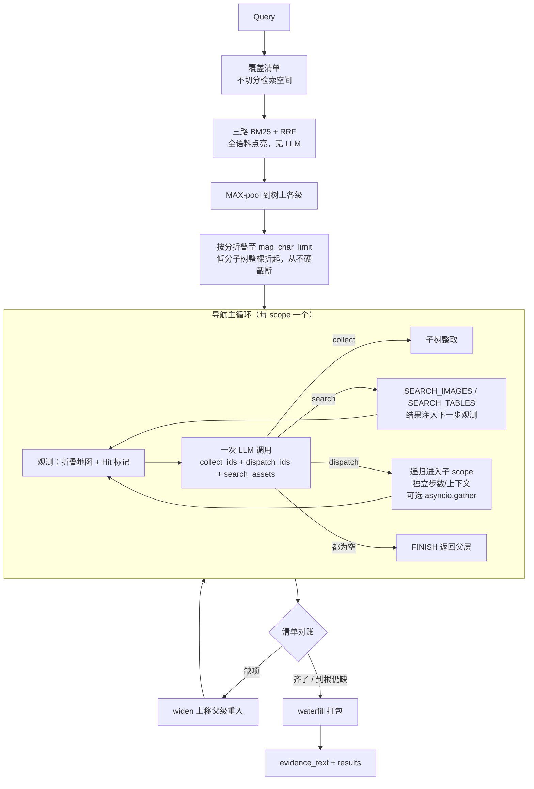

# MAP-NAV × Planning × Knowhere 融合迁移

## 一、实测基线（先记录，避免后续凭印象决策）

四道长河坝档案题，按 probe 里的 `reference_answer` 语义计分（对=1 / 半对=0.5 / 错=0，满分 5）：

- baseline MAP-NAV：3
- fusion（PLAN×NAV）：1.5
- Knowhere 默认预算：3.5
- Knowhere 放开预算：4.5

必须同时记住的定性事实：

- **Knowhere 是用体量换命中**：q2 用 34 chunk / 29433 字拿 3/4 gold，baseline 用 6 section / 5498 字拿 4/4；q4 放开预算灌 201 行 / 10 万字，gold 仍只有 1/3
- **Knowhere 没有重入**：`FINISH` 对该文档是终端（`agentic/navigation/document.py:360`），q4 默认预算直接 0 证据
- **fusion 两头都输**：12 分制的 gold recall 只拿 4，还花了最多的钱（q4：15 次 API、35k prompt、30 秒）
- **关键词命中会假阳性**：baseline q1 答「未找到王仁坤作为总工程师…」，`answer_keys` 3/3 全中但答案全错。所以后续一律按 `reference_answer` 计分

**诚实的结论**：这组数据**不能证明** MAP-NAV 的动作模型比 Knowhere 更好——Knowhere 的 q1 拿 3/3 是因为一次跑就看了两篇，baseline 按篇跑才 0，那是多文档带来的差异。迁移的正当理由只有两条，都与「谁的动作更聪明」无关：文档数扩展性、以及缺失重入。方案的每一处取舍都应该回到这两条，不要用「我们的更好」来论证。

## 二、目标架构



## 三、设计决策（每条附依据）

### 3.1 不做「选文档」，改用折叠地图作为入口

**依据**：`build_knowledge_map_overview` 把活跃文档逐条列进 prompt，硬上限 `_MAX_OVERVIEW_FILES = 50` 且按 `updated_at desc` 截断——上万文档时是任意取 50 篇，不是选择。这是架构硬墙，与效果好坏无关。

替换关系要分清，三个部件里只有两个半是新的：

- **点亮层不用移植**。`src/nav/knowhere_hybrid.py` 文件头写着 "Ported from Ontos-AI/knowhere ... search/{scoring,lexical_ranker,channels}.py"，权重 `path=1.0 / content=2.0 / term=1.5`、`RRF_K=60` 两边逐值一致。直接用 Knowhere 现成的 `bottom_discovery` / `channels.py`
- **MAX-pool 到树上**（新）：`_pool_unit_scores_to_tree`（`nav_map_scores.py:138-173`）把 leaf 分数向上取 max，让每个 section / 文档节点都有分。Knowhere 只有平铺 fused rows
- **按分折叠**（新）：`_apply_budget_hide`（`nav_projection.py:222-279`）按 `(score, -n_descendants, -depth)` 排序逐棵隐藏低分子树直到装进 `map_char_limit`，保护 must_keep 脊柱，**从不硬截断**。这正是 `_MAX_OVERVIEW_FILES` 做不到的
- **`[Hit]` 标记**（半新）：`select_map_highlights` + `format_hit_tag`。Knowhere 的 discovery hints 是往 overview 塞一行文字，不是地图上的节点标记

删除：`kg_document_select`、`build_knowledge_map_overview`。

### 3.2 地址模型用生产的 namespace 四级地址

**依据**：既然砍掉选文档，首版就是多文档，原 plan 里「四级地址仅多文档需要、不挡首版」的降级不成立，**升级为阻塞项**。

实验内核当前地址是字符串拼的合成 id，层级靠魔法后缀判定：`is_synthetic_dispatch_only` 用 `sid.endswith(":__doc_root")`（`nav_actions.py:21`），`doc_id_for` 用 `s.split(":", 1)[0]`（`path_ledger.py:44-45`）——document_id 或 section_path 里出现冒号就解析错。

生产 schema 四级本来就是真实主键（`shared/models/database/document.py`）：

- 根 scope = `(user_id, namespace)`，已有索引 `idx_document_sections_scope` / `idx_documents_user_namespace_status`。**它不是节点、没有对应行**，内核要接受「scope 为空 = namespace 根」，而不是造 `__corpus__:__root` 字符串
- 文档级 = `Document.document_id`
- 章节级 = `DocumentSection.section_id`，树靠 `parent_section_id` 自引用 FK，序靠 `sort_order`，深度有 `section_level`
- 单元级 = `DocumentChunk.chunk_id`

改法：引入 `NavAddress(level, id)`，level ∈ namespace / document / section / chunk，层级来自字段而非字符串后缀。需一并改写的耦合点：`nav_actions.is_synthetic_dispatch_only`、`nav_compose.py:129` 的 `:__doc_root` 特判、`nav_map_scores.py:392-411` 造 doc_root / corpus_root 打分键、`nav_navigate.py:344-361` 的 `is_corpus_doc_id` / `is_doc_root_section` 深度判定。`path_ledger.py` 整个模块废弃，`retrieved_nodes` 从 `{doc}:L{n}` 改为 `chunk_id`。

### 3.3 动作集：COLLECT / DISPATCH / FINISH + SEARCH_*

**真冲突只有一对：EXPAND vs DISPATCH。** 两者都是「进入子节点」，语义重叠。同时给 LLM 就是让它猜——这正是 F2 里 `reharvest` 与 `widen`「语义重叠到没法讲清楚区别」被整体推翻的同一个错误，不该在动作层重犯。选 DISPATCH（多给子作用域/子步数/上下文隔离），**EXPAND 删**。

**BACK 连带删除**：DISPATCH 语义下子 agent `return` 就是回退，留着会制造「该 BACK 还是 FINISH」的歧义。为它服务的 Knowhere `agentic/navigation/path_ledger.py` 一起删（实验仓 `src/nav/path_ledger.py` 也因地址改造废弃）。

**COLLECT 不是冲突，是两个独立选择**：

- **范围**：取 MAP-NAV 的子树语义（`section_id ∪ 全部后代`）。依据是 q2——gold 是 `2.3 水文基本资料` 加它 3 个子节点这一整个邻域，baseline 用 6 个 section 拿 4/4，fusion 拆开窄搜只有 1/4
- **形式**：扩展 `harvest` 的一次调用返回结构，加上资产字段：

```json
{
  "collect_ids": ["C1"],
  "dispatch_ids": ["D2"],
  "search_assets": [{"kind": "images|tables", "query": "...", "scope": "optional"}],
  "confidence": {"C1": 0.8},
  "reason": "short reason"
}
```

这跟 Knowhere 的「主动作 + collect 副作用」同构但更对称；`search_assets` 与导航列表正交，不制造 EXPAND/DISPATCH 那种歧义。F5 dismiss 仍挂在「展示过但 collect/dispatch 都没进」上（资产搜索本身不算跨过该节点）。

**SEARCH_IMAGES / SEARCH_TABLES：保留。** 纯资产查询（「给我那张地质剖面图」）是真实需求，不能只靠宿主 section 被 COLLECT 顺带带出。落地要点：

- 保留 Knowhere `agentic/navigation/assets.py` 管线与现有检索逻辑
- 结果注入下一步观测（现状就是这样），不另开导航语义
- 预算简化后，`_asset_filter_prompt_budget()`（`assets.py:577-580`）不能再读 `config.planning_ratio`，改为读新的单一 episode 上限（或固定/派生的 prompt 软帽）
- 宿主挂载仍保留：正文 `[tables/]` / `[images/]` 引用挂宿主 section，COLLECT 宿主时一并带走；SEARCH_* 是主动找资产的补充通道，不是替代

**FINISH 粒度下沉**：Knowhere 的 FINISH 是「这个文档到此为止」，递归后变成「结束本层、返回父层」，只有最外层等价。

**隐藏坑**：`max_nav_steps=6` 现在的含义是「每文档 6 步」，递归后应为「每 scope N 步 × `max_dispatch_depth`」，**数值不能直接沿用**，否则要么走不动要么成本失控。

### 3.4 递归 DISPATCH：保留；并发用 asyncio.gather，首版默认关

**修正此前结论**：递归与并发要拆开；线程池并发有债，但 **async 并发没有那条债**。

DISPATCH 给四样东西：

1. 子作用域隔离——子 agent 只看子树，不继承父层累积的 nav_trace
2. 子步数——子 agent 拿完整的 `navigate_max_steps`，不吃父层的（旧的 `child_budget = budget * 0.85` 在单一 10 万上限模型下改为共享同一计数器，不再按比例切子钱包）
3. 上下文隔离——父层 prompt 不膨胀
4. 并发——可多子 scope 同时推进

解决「进去发现节点很大」的是 1/2/3。并发是延迟优化，不是语义必需。

**并发怎么做（纠正「不能并发」）**：

- **不要**移植实验仓的 `ThreadPoolExecutor`：Knowhere 的 `LLMFn` 是 `await llm_fn(...)`，`AsyncSession` 也不能跨线程
- **要**用 `asyncio.gather(*[navigate(scope=c) for c in children])`：无线程、无 `merge_lock` 跨线程问题；token 计数器用 `asyncio.Lock` 即可
- **首版默认关闭**（串行 `for` / 等价于 gather 一个）：实现简单、成本轨迹好读；实测 fusion 开了并发却只有 1.5/5，不能当首版默认
- **打开时的硬约束**：多个子 agent 若先各自读「未超限」再一起发 LLM，会冲破 10 万上限。必须把「检查剩余 + 预留本调用估算」放进同一把 `asyncio.Lock` 原子化；超限的子任务直接 FINISH，不发起调用

配置建议：`RETRIEVAL_NAV_DISPATCH_CONCURRENCY`（默认 `1` = 串行；`>1` 时 gather 上限）。

**与折叠的分工别混淆**：折叠解决「大节点的子列表太长」；DISPATCH 的子作用域解决「进去之后要走很多步」和「上下文一路累积」。两个都要。

### 3.5 planning 退居为覆盖清单 + 重入回路

**依据**：`plan_control` 的实际决策显示，前置切分破坏了 MAP 的邻域性。q2 拆 3 个 subgoal，s1 以 "Rule signal indicates contract satisfied" 提前 accept，只 pack 2 个 section；q4 拆 4 个 subgoal，`widen` 触发两次但入口 anchor 从一开始就散在四处。对比 Knowhere 的 q2 是 `workflow_single_step` 不拆，一次导航落到 `2.3 水文基本资料` 就扫了整棵子树。

改法：

- `nav_plan.plan_query` 产出**覆盖清单**（必须出现哪些事实）+ **单一共享检索空间**，不再给每个 subgoal 独立的 `scope_filter` / `route_hints` / 独立 anchor
- 只有跨实体对比、或 2+ 互不相干的问法才真拆并行分支——直接借用 Knowhere planner 的保守判据（`workflow/planner.py:42-48`），它「大多数查询单步」的默认是对的
- `plan_control` 的 accept / widen / drop **机制不动**（F1–F5 已在代码中落地），只把对账对象从「per-subgoal 契约」换成「全局覆盖清单」
- `Subgoal.budget_share` / `activation` 在单空间下语义失效，废弃

这一层是 Knowhere 完全没有的，也是 q4 拿 0 分的直接原因。

### 3.6 预算简化为单一上限

**现状太复杂**：`BudgetWallet`（总 20 万 / 每 step 4 万）+ `BudgetLedger` 三池（bootstrap / planning / context，`planning_ratio=0.5`）+ per-doc caps + reserve / commit / refund / overdraft 记账 + `trim_evidence_to_budget`。约 520 LOC，且今天已经证明它会以两种方式伤人：doc_cap 预分让报告2 只拿到 2544 token 一轮就没；trim 把 39051 砍到 17100 却输出 0 字。

**新模型——一个计数器，一条规则**：

- 一个 episode 累计所有 LLM 调用的 token 用量，上限默认 **10 万**（env `RETRIEVAL_NAV_TOKEN_LIMIT`）
- 每次发起 LLM 调用前检查：超限就不再发起新调用，当前 scope 直接 FINISH，逐层返回父级
- 已 collect 的内容照常打包返回，`stop_reason='token_limit'`。**不失败、不清空、收集到什么给什么**
- 保留 `latency_budget_ms` 作为第二个硬停条件，同样是「停止并返回已有」

**删除**：`workflow/wallet.py` 整个、`BudgetLedger` 的三池与 `planning_ratio`、`_doc_caps` / `per_doc_cap` / `allocate_doc_caps`、`reserve` / `refund` / overdraft 事件、`trim_evidence_to_budget`。

**保留**：证据包大小仍由 MAP-NAV 的 `pack_nav_evidence(budget_chars)` waterfill 控制。这是两件不同的事——token 上限管的是「花多少钱去找」，`budget_chars` 管的是「最后交多少字」。不要合并。

**顺带效果**：`trim_evidence_to_budget` 被删除，那个零证据 bug（初始估算用 `estimate_tokens(full_text)` 含渲染结构开销、删除估算用 `_estimate_chunks_tokens` 只含正文，leaf 删光后 `has_leaf_content()` 为 false 导致 `render_evidence` 返回空串）随之消失，不需要单独修。

**注意**：本会话早先落地的 flat per-doc cap（`RETRIEVAL_AGENTIC_PER_DOC_CAP`，每篇 2W）在这个模型下作废，一并删除。它当时是止血，不是终局。

## 四、分阶段落地

### P0 实验仓改造（先在这里验，顺序有依赖）

1. **address**（阻塞其余全部）：`NavAddress` 四级地址落地，废弃 `path_ledger.py`
2. **corpus_nav**：入口 scope 改 namespace 根，折叠地图 + `[Hit]` 构建初始地图；两篇报告作为同一语料一起跑
3. **actions**：`harvest` 形式扩展为 `collect_ids` + `dispatch_ids` + `search_assets`；COLLECT 子树语义；保留 SEARCH_*，改掉 `assets.py` 对 `planning_ratio` 的依赖
4. **dispatch_concurrency**：废弃 `ThreadPoolExecutor`；实现串行默认 + 可选 `asyncio.gather`；预算检查与记账原子化
5. **checklist**：`plan_query` 改覆盖清单，`plan_control` 对账对象换成全局清单
6. **budget_simplify**：单一 token 上限

### P1 验证（不过这关不进生产）

- **scoring**：把 `reference_answer` 事实清单计分固化进 `bin/run_knowhere_probe.py`，取代 `answer_keys` 关键词命中
- **validate**：三臂对照 baseline / 旧 fusion / 新方案
- 两个必须复现的 case：q2 拿回 `2.3 水文基本资料` 整个邻域（4/4）；q4 在**默认预算**下拿到证据
- 通过线：新方案要同时超过 baseline 的 3 分与 Knowhere 默认预算的 3.5 分。达不到就回到 P0 找原因，不要带着退步接生产

### P2 Knowhere 接入

- **loader**：`KnowhereProvider` 补按 `(user_id, namespace)` 的 `AsyncSession` 查询，预加载 sections + chunks 成同步快照。按 `Document.current_job_result_id` 做 revision 隔离，否则混入历史版本
- **route**：`execution/routes.py:40` 的 `use_agentic is True` 分支改接 `_run_mapnav_route`，返回 `RetrievalRouteOutcome`。`results` 行需满足 `PUBLIC_RESULT_FIELDS` 白名单 + `job_id/file_path/chunk_metadata`（资产）+ `document_id/chunk_id`（hit stats）
- trace 复用 `retrieval_runs` / `retrieval_steps`，落 plan / harvest / plan_control

### P3 退役

删除清单：

- `EXPAND` / `BACK` 动作族与为 BACK 服务的 `agentic/navigation/path_ledger.py`
- `kg_document_select`、`build_knowledge_map_overview`（保留 `bottom_discovery`）
- `workflow/wallet.py`、`BudgetLedger` 三池与 doc caps、`trim_evidence_to_budget`
- 与新 planner 重叠的 `workflow/QueryPlanner`
- 实验仓 `ThreadPoolExecutor` DISPATCH 路径（被 `asyncio.gather` 取代，默认关闭）

**明确保留**：`SEARCH_IMAGES` / `SEARCH_TABLES` 与 `agentic/navigation/assets.py`（接新预算）；宿主引用挂载逻辑。

必须保持通过：`test_retrieval_contract.py`、`test_retrieval_workflow_session_contract.py`、`PUBLIC_RESULT_FIELDS` 白名单、`RetrievalRouteOutcome` 五字段。

## 五、刻意不做

- 不引入 LLM 选文档 / 文档清单进 prompt
- 不把 `__corpus__:__root` / `{doc}:__doc_root` / `doc:L{n}` 合成 id 带进生产
- 不移植 DISPATCH 的 **线程池** 并发（改用 `asyncio.gather`；首版默认 concurrency=1）
- 不引入 VLM（SEARCH_* 仍走现有非 VLM 资产检索）
- 不把整段内核改成 async 重写（同步快照 + 导航循环里对 LLM/DISPATCH 用 await；不是全量 async 化）
- 不碰 API 请求 / 响应契约，只换路由实现
- 不解决全语料 in-memory BM25 的计算瓶颈（见下）

## 六、已知遗留风险

- **计算瓶颈**：`channels.py` 与 `knowhere_hybrid.py` 都是把候选全量拉进 Python 做 BM25 排序。上下文爆炸由折叠地图解决了，**计算爆炸没有**。本次不解决，但不要假装它不存在
- **样本量**：全部结论建立在 4 道题上，且只验证了证据层与 gold section 层，没有大规模答案正确性评估
- **并发打开后的预算冲刺**：若未原子化「检查+记账」，`asyncio.gather` 可能短时冲破 10 万上限——实现时必须锁内预留
- **步数配置语义变更**：`max_nav_steps` 从「每文档」变「每 scope × 深度」，沿用旧数值会出问题
