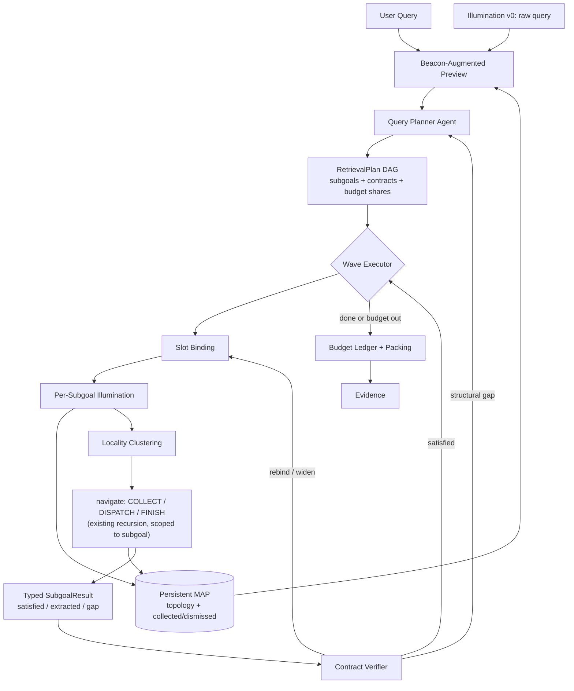

# MAP 之上的 Agentic 查询规划层

## 0. 可行性结论（先说）

**可行，且现有代码结构对这个扩展异常友好。** 三个关键支撑：

- `compute_map_and_unit_scores(ts, doc_id, query, ...)` 已经把 query 作为参数——**按子目标重复点亮地图几乎零成本**（BM25，无 LLM），这是整个设计最核心的机制，却只需要把一次调用改成循环。
- 现有 `navigate()` 递归天然就是"在一个区域里找东西"的原语，规划层只需在它之上，不需要改它内部。
- 地图**已经是一块可变的共享黑板**：`collected_section_ids` 会把收过的枝从地图移除、`dismissed_section_ids` 隐藏无关枝。这正是主流 agentic RAG 缺的东西（它们的语料是不透明向量库，唯一记忆是 context window）。

**主要代价**：LLM 调用从 4–7 次升到 12–20 次；planner 误判会引入新的失败模式（用"软计划"缓解，见 §5）。

---

## 1. 审计：现状的七个结构性限制

逐条对应后面的机制，不是泛泛而谈。

> **先对齐 MAP 的真实形态**（避免后文误读）：`_build_map_tree` 从 root 递归展开**全深度**（`max_nodes=20000`，每层 `map_children_limit=10000`），**无深度上限**；`_apply_budget_hide` 按**分数升序整枝隐藏**（`_mark_hidden_subtree`），直到估算字符数落进 `map_char_limit`（默认 5000），**depth-0 的根也可被隐藏**，且**从不硬截断**。`must_keep` = highlight ∪ 其全部祖先，`_protected_spine_ids` 保住任何子树含 must_keep 的节点。
> 所以：**它是一棵按分数剪枝的全深度层级树**，深层命中本来就带着完整祖先链显示在树上。`map=title-only` 指的是**不内联 summary**，与深度无关（根永远 title-only；scoped region 在够小时才内联 summary）。

- **A1 · 没有任何查询规划。** `run_nav_episode` 拿到 raw query 后直接进 `navigate(depth=0)`，整个 episode——包括所有 depth>0 的 subagent——自始至终用的都是同一个原始 query 字符串：没有解构、没有改写、没有子查询。depth-0 agent 事实上在承担规划职责（决定先去哪、之后去哪、何时收手），但这份"计划"只以单步 `action_id` + 25 词以内的 `reason` 的形式存在，**隐式、无类型、执行前无法检查、执行后无法复盘、无法单独消融**。所谓"decompose 太粗糙"的准确定位是——**MAP-NAV 路径上根本不存在 decompose 这一步**。

- **A2 · 检索信号在 episode 开头冻结（最深的限制）。** `map_scores` / `unit_scores` / `highlight_ids` 用 raw query 算一次，之后整个导航过程——包括所有 depth>0 的 subagent——都看同一套点亮。**子 agent 被派去找 B，但地图上亮的还是 A+B 混合的光。** 多步检索在这个前提下不可能真正成立。

- **A3 · COLLECT 的枝内选择是 query-盲的。** map mode 下 `_collect_subtree` 走 `_collect_in_doc_order`，**完全不看 query**，整枝按文档序灌池。对枚举型需求这是对的，对单点事实型这是浪费。取什么由预算截断兜底，而不是由需求决定。

- **A4 · FINISH 不可验证。** 提示词写的是"evidence is sufficient, or this region is irrelevant / exhausted"——纯凭感觉。没有任何"我要找的是 6 项，现在有 4 项"这类可检查的完成条件。

- **A5 · 预算是单一全局池，没有按需求预留。** `pack_nav_evidence` 在一个池子里排序打包。多步查询里第一跳的长证据会结构性地挤掉第二跳——**这不是打包算法的 bug，是预算模型里根本没有"跳"这个概念**。

- **A6 · `RegionReport` 是自由文本。** 字段是 `summary` / `reason` 字符串。子 agent 无法向上交出**结构化的槽位值**，所以"第二步查什么取决于第一步查到了谁"在今天的接口下无法实现——这正是你要的条件依赖缺失的根因。

- **A7 · 剪枝只由一个 raw query 决定（规划层的鸡生蛋）。** 跨文档下 5000 字符只够约 39 行，绝大部分树会被剪掉。剪枝完全由 **raw query 的单一打分**决定——**任何没在原始 query 字面里表达出来的子需求，它的区域在 planner 看到地图之前就可能被剪掉**。要点亮得先有计划，要做计划得先看见地图。**不靠折叠处贴 summary 来补**（那会挤掉可见标题，违背 title-only 纪律）；靠 Pass 0 覆盖偏置点亮 + 规划投影更大的 `planning_map_char_limit` 来缓解。

**A8 · 度量层（本设计范围之外，但决定你能否验证）**：MAP-NAV 自身的 judged 结果里，证据侧改进传导到 task 分的通道是堵的——gold 原文已完整落入 evidence 的样本，task 分仍然普遍很低，且存在 composed 与 gold 近乎逐字一致却判 0 的情况。这不是架构问题，本方案也不处理它；但新数据上**建议先用"gold 证据直喂 compose"跑一个 oracle 上界**，确认 judge 能区分检索质量，否则本方案的收益无法被观测到。

---

## 2. 目标架构：PLAN → ILLUMINATE → TRAVERSE → VERIFY → REBIND/REPLAN → SETTLE

核心命名：**结构条件化的查询规划（Structure-Conditioned Query Planning）**。与主流方案的根本差别是——**先看地形再拆题**，而不是在真空里拆完题再去找。



### M1 · 规划用地图先只放宽预算（对应 A1、A7；刻意做薄） — **已完成**

**核心是 plan 能力，不是地图渲染花活。** M1 第一版只做一件事：

- 规划这一趟用独立的 `planning_map_char_limit`，先调到约 **10000**（执行器仍 5000）。
- 其余与现行一致：全深度剪枝树、根 title-only、折叠处不贴 summary、`must_keep` 规则不变。

**落地**：`NavConfig.planning_map_char_limit` + `build_planning_observation()`（`nav_plan.py`）；默认写在 `config/nav_default.json`。

下面两项是**辅助微调，后置，不进第一版**：

- 规划时限制每枝深度、多露兄弟方向（以前说的「看得更宽」）。
- 高亮点同级兄弟也纳入 must_keep。

有了可跑的 plan 再决定要不要加；现在不加也不堵路。

### M2 · 计划表示：带硬/软依赖与延迟绑定的 DAG（对应 A1、A6） — **已完成（开环）**

```python
@dataclass
class Activation:
    mode: Literal["always", "on"]  # on = 条件分叉
    on: str                        # 父 subgoal id
    when: str                      # 自然语言谓词（执行侧 M5 才判定）

@dataclass
class Subgoal:
    id: str
    need: str
    retrieval_query: str           # 必须与 map 标题 / 用户 query 同脚本；可含 {{s1.slot}}
    depends_on: List[str]          # 硬依赖（含 slot 引用与 activation.on 自动推导）
    prefer_after: List[str]
    contract: Contract
    scope_filter: ScopeFilter
    budget_share: float            # 仅 always-active 子目标参与归一化池
    produces: List[str]            # 原子：至多一个槽名
    activation: Activation         # 取代旧 alternatives 列表
    route_hints: List[str]         # 仅保留能解析到可见 map 节点的 hint

@dataclass
class RetrievalPlan:
    subgoals: List[Subgoal]
    relations: List[SubgoalEdge]   # parent-child | sibling（省略 = unrelated）
    reason: str
    map_coverage: Literal["sufficient","partial","insufficient"]
```

**条件触发仍分三层**（M2 只产出前两层的**声明**；执行在 M5）：

1. **槽位延迟绑定** — `{{s1.entity}}`；parse 时自动补 `depends_on` / `produces`。
2. **预置条件分支** — 用 `activation={mode:on,on,when}`（旧 `alternatives` 仅作 parse 兼容迁移）。
3. **完整重规划** — 仍属 M5；M2 未接。

**M2 质量约束（已落地，禁止魔法数/过拟合）**：

- `retrieval_query` 脚本必须匹配用户 query + map **titles**（不用 observation 英文 chrome 当参考）。
- 嵌套 plan JSON 用 brace-balanced 抽取（不复用 navigate 的非贪婪 `_extract_json_obj`）。
- purpose=`nav_query_plan_v2`；`enable_query_planning` 默认 false；episode 只 emit `query_plan` step，**不改 navigate**。

**借 PlanRAG**：依赖边 `parent-child` / `sibling`（不再写 `unrelated`）；原子性 = 单 (S,R,O) + 单 produce 槽。

> **与 M3 的关系（关键）**：M1+M2 =「看得见地形 + 产出可审计计划」。此时检索仍用 raw query 单光源，**计划还不改变点亮/折叠/COLLECT**。M3 起才用每个子目标的 `retrieval_query` 多光源点亮，并按未满足目标重排折叠——**从开环规划变成真正改变检索状态**。要看见检索收益至少到 M3；完整 Plan–Execute–Verify–Replan 要到 M5。

### M3 · 多光源点亮 + 目标条件化折叠（对应 A2，本方案技术核心） — **已完成（执行期 Pass1）**

**落地（默认关，消融干净）**：

- `enable_per_subgoal_illumination` / `enable_goal_conditioned_folding`（`nav_default.json`）
- `nav_illuminate.illuminate_from_plan`：plan 之后、navigate 之前；TRACE `action=illuminate`
- `compute_multi_query_map_scores` + `merge_score_maps` = `max_s(w_s · score_s)`；`select_map_highlights_multi` 产出 `hit_sources`
- 观测 `[Hit:s1,s3]`（`format_hit_tag`）；条件子目标进 fold 需 `activated_subgoal_ids`（M5）；未绑定 `{{slot}}` 的 query 跳过
- `satisfied_subgoal_ids` → `refresh_fold_from_subgoal_scores` 衰减钩子（M5 调用）
- **后置**：Pass 0 覆盖偏置打分（现用 episode 开头 raw-query 打分充当 Pass 0）

`state.map_scores` 从 `Dict[section_id, float]` 变成 `Dict[subgoal_id, Dict[section_id, float]]`，每个子目标用自己的 `retrieval_query` 调一次现成的 `compute_map_and_unit_scores`。

**先解 A7 的鸡生蛋：两趟点亮。** Pass 0 用 raw query（外加一轮免费的词面扩展：同义词/上位词/去疑问词，纯 BM25 不花 LLM）点亮，**目的是拉高召回、让剪枝别太狠**，配合 M1 的广度偏置产出规划投影；Pass 1 才按子目标各自点亮、切回深度偏置。要点是 Pass 0 的评分函数应当**偏向覆盖而非精度**——planner 宁可看到一些无关区域，也不能有整片区域在它做决定前就消失。

由此得到两个新能力：

- **地图按未满足的需求重新折叠。** 折叠排序权重改为 `max_s(w_s · score_s(node))`，其中 `w_s` 随子目标满足度衰减。**s1 满足后，它的区域自动折叠让位，显示预算流向还没满足的 s2/s3**——地图会随任务推进主动重排版面。这是"渐进式披露"从静态阈值升级为目标驱动的关键一步。
- **观测行标注光源**：`[N19] … [Hit:s1,s3]`。agent 一眼看出哪个区域服务哪个需求。

### M4 · 地图局部性聚类：并行/串行由地形决定（对应 A1） — **骨架已完成**

一波内的就绪子目标，不是简单全并行，而是先看它们的 beacon 落在哪：

- beacon 聚在同一子树 → **合并成一次遍历**，带复合契约（省调用、避免两个 subagent 重复走同一片区域）
- beacon 分散在不相交子树 → **并行 DISPATCH**（复用现有 `ThreadPoolExecutor` + fork/merge）
- 有硬依赖 → 分波串行

即：**执行顺序 = 依赖 DAG ∩ 地图局部性**。这是纯依赖分析给不了的调度信号，也是"最优利用 MAP"的直接体现。

**落地**：`nav_orchestrate.execute_plan` / `cluster_by_locality`；soft focus（只改 prompt，**不裁** C*/D*/F*）；flags `enable_plan_orchestration` / `enable_locality_merge` / `max_waves` 默认关。

**已知缺口（下一步收口）**：

- `prefer_after` 可解析入库，但**不参与 wave 排序**（环依赖时还会把硬 `depends_on` 降级塞进它 → 依赖蒸发）。
- 并行 fork：`steps_out=None` → 子 navigate TRACE 丢步；`map_scores` 等按引用共享，有竞态风险。
- soft focus 的 `User query:` 仍是 episode 原问；子目标 `retrieval_query` 主要靠 focus.need + 地图打分，未完整进入 policy 主 query 通道。

**升级路径（借 PlanRAG）**：上面是启发式聚类；PlanRAG 用**代价模型 + 动态规划**来组织执行树。我们的代价维度是现成的且比它们更具体——`n_chunks`（要读多少字符）、子树深度（要几次 LLM 调用）、beacon 集中度（命中概率）、`budget_share`（配额）。先按启发式落地，若 M4 被证明有效再换 DP，属于第二轮优化，不阻塞 P3。

### M5 · 契约验证：让 FINISH 可判定（对应 A3、A4） — **部分完成（闭环未接线）**

**目标行为（方案正文，仍有效）**：

- **契约决定枝内水合策略**（直接修 A3）：`enumeration` → 保持文档序整枝（现行行为正确）；`single_fact` / `span` → 按该子目标的 unit score 定向取。**取什么由需求类型决定，而不是一律灌池再靠预算截断。**
- **契约决定 FINISH**：verifier 检查 `enumeration` 的条目数是否达到 `cardinality`；`single_fact` 检查槽位是否抽出；`must_mention` 缺失 → 放宽搜索。
- verifier 输出**带类型的控制信号**，不是自由文本，且必须给出具体缺口（`gap`）：

| Verdict | 含义（目标） | 执行器应做什么 |
|---------|--------------|----------------|
| `SATISFIED` | 契约满足 | 写入槽位 bindings；可激活 `activation.on` 条件支；fold 衰减该子目标 |
| `RETRY_SAME_REGION` | 证据不足 / 枚举未满 / 空证据 | **同一 soft-focus 下再 navigate 一轮**（有限次），不换 plan |
| `WIDEN` | `must_mention` 等缺口，疑似 scope 过窄 | 放宽 / 清空该子目标的 `scope_filter`（或扩大 focus），再试 |
| `REBIND` | 有证据但槽位抽不出 / 抽错 | 重跑 slot extract（可换启发式↔LLM）；必要时用未绑定的原始 `retrieval_query` 降级依赖 |
| `REPLAN` | 结构缺口（拆题错了） | 受限调用 `plan_query` 重规划（受 `max_replans`） |
| `ABANDON` | 明确放弃该支 | 标记失败，**不**当 satisfied；不阻塞无关并行支 |

`RegionReport` 扩展（修 A6）→ `SubgoalResult`（已有 dataclass + `verdict` 字段）。

**当前实现实况（2026-08 自查；下一步要修）**：

| 能力 | 状态 |
|------|------|
| `extract_slots` / `verify_contract` / `activation_when_holds` / `slot_bindings` | 代码有 |
| `RETRY` / `WIDEN` / `REBIND` 被 verify 产出 | **有**（规则：空证据→RETRY；缺槽→REBIND；枚举短→RETRY；must_mention 缺→WIDEN） |
| 上述 verdict 驱动再导航 / 放宽 / 重抽 | **无** — orchestration 一律「一试即关」 |
| `REPLAN` / `ABANDON` | 类型有；`verify_contract` **从不产出**；execute 里 `if verdict=="REPLAN"` 死路径 |
| 契约驱动 COLLECT（A3） | **未做** — 仍文档序整枝 |
| `scope_filter` | schema+prompt 有，执行期不用 → WIDEN 即使接线也暂无滤镜可放宽 |
| `satisfied_subgoal_ids` | **语义被改坏**：任意 attempt 都 `add(sid)`，fold 衰减把「试过」当「满足」 |
| verify 关闭时 | 「有新 evidence ≈ satisfied」，槽可空 |

> **Soft-plan 澄清（勿与 anti-stall 混淆）**：方案里的 soft-plan = 子目标只影响光照/配额/focus 文案，**绝不裁剪 C\*/D\*/F\***。现行 `one attempt closes the node` 是实现自创的防死锁，**不是** soft-plan；修复时应拆 `attempted_subgoal_ids` vs `satisfied_subgoal_ids`，用有限 retry 预算代替「假 satisfied」。

### M6 · 预算账本：把预算变成一等规划资源（对应 A5）

三层分配，**内层直接复用现有 waterfill**，改动面很小：

- Tier 1：每个子目标拿到 `min(floor_s, actual_need_s)`，`floor_s = B · budget_share_s`
- Tier 2：未用完的份额回流到契约未满足（尤其是枚举未尽）的子目标
- Tier 3：子目标内部按现有 `pack_nav_evidence` waterfill 打包

这从结构上保证第二跳不会被第一跳饿死。

### M7 · Facet：文档/模态定位（回应你的"只要图"）

`ScopeFilter { doc_ids, modality: text|table|figure|formula, section_kind }`，三处生效：planner 可为单个子目标声明；点亮时做掩码；beacon 行渲染 `[table]` / `[figure]` 标签。也支持用户在 episode 级手工指定，覆盖 planner。

**前置条件（数据侧）**：当前语料 JSONL 只有 `doc_id / line_id / content / gold_level / previous_level`，**没有 modality 字段**。模态 facet 需要先在语料层加属性，否则这一项落不了地。

### M8 · 可选的第七个动作：PROBE（需你拍板）

给执行器一个**在循环内重新点亮地图**的动作 `P*`：不移动 viewpoint、不收证据，只用新 query 重算当前 scope 的光照。这是 ReAct 在 MAP 上最自然的形态——agent 走到一半发现该换个词去找。

注意这**会改动动作空间**（skill 里有"不恢复 JUMP/PEEK/EXPAND 当主循环"的硬约束）。PROBE 与那些被删的动作性质不同——它不是移动动作，是重打分动作，不制造空转路径。但仍建议**独立开关、独立消融**，默认关。

---

## 3. 与主流 agentic retrieval 的对齐与差异

**已被覆盖、不能当创新点主张的部分**（重要，避免论文定位失误）：

- **PageIndex**：把 ToC 作为 in-context index 交给 LLM 推理式导航，**并且已经会自动把复杂 query 拆成子查询、各自独立走一遍树再合成**。"先看结构再拆题"这件事本身，它已经落地了。
- **PlanRAG（逻辑查询树，2026）**：拆原子查询 → 依赖三分类 → DP 组织成树 → 并发执行、结果向上传播。
- **DecomposeR（2026）**：typed DAG 计划、planner 与 executor 分离、topological-wave execution（与 M4 几乎同名）。
- **Plan\*RAG**：DAG 外化推理、`<AI.J>` 延迟绑定、同深度并行 → 对应 M2。
- **MemWalker**：LLM 在摘要树上迭代导航、沿途维护 working memory。
- **VMAO / Self-RAG / CRAG**：verify-replan 闭环、IsRelevant/IsGrounded/AnyGaps 反思、可配置停止条件 → 对应 M5。

再往前追，"把结构先给模型看再让它规划"在 text-to-SQL 里就是 schema linking，是成熟多年的标准动作。

**真正还没被覆盖的两点**（论文若要投，主张必须落在这里）：

1. **同一张持久地图被多个子目标分别点亮。** 上述方案的子查询都是**各自独立走一遍**，彼此无共享状态；这里子目标共用一张会变形的地图，一个节点可被 `[Hit:s1,s3]` 同时照亮，执行器据此把两个需求合并成一次遍历（M3+M4）。这是结构性差别，不是实现差别。
2. **观测空间随目标满足度重新折叠。** s1 满足后其区域自动折叠让位，显示预算流向未满足的 s2/s3——**渲染是"未满足需求"的函数**（M3）。上述工作的语料视图全是静态的，动态的只有 agent 的 context。这一条最独特。

统一起来的说法是：**检索状态即可变观测空间**——MAP 同时是动作空间和记忆，并在计划推进下形变。以此为主张时，上面那些工作全部落位成 baseline 而非撞车对象。

### 3.1 可直接借鉴的具体设计

按对本方案的价值排序：

- **~~PageIndex 的 LLM rollup summary~~ — 已评估并否决。** `summary_rollup.py` 已有自底向上 title 枚举；本语料标题本身语义完整。LLM 摘要增量不大且贵。**折叠处也不贴 covers summary**（会挤显示预算，违背 title-only）；现有 covers 仍只按现行规则在小 scope 内联使用。
- **DecomposeR 的"计划本身可独立评分"。** 它用 rubric coverage 给 plan 打分、与最终答案解耦。对我们的直接用途：**P1 阶段就能验证 planner 质量，不必等执行链路建完**，也避免把"计划差"和"执行差"混在一个指标里。这是最实用的一条方法论借鉴（我们不做 RL，但 rubric 可以零样本用）。
- **PlanRAG 的依赖三分类与原子性判据。** 已并入 M2。
- **PlanRAG 的代价模型 + DP 排序。** 已作为 M4 的升级路径。
- **Plan\*RAG 的 per-node 上下文隔离**：每个 DAG 节点只把**依赖父节点**的结果放进 context。现在 `_fork_nav_state` 虽已隔离状态，但 `reports_context` 是整块字符串往下传；改为只传依赖父的报告，可显著压 context 且减少无关信息干扰。
- **PageIndex 的固定 2 次调用**：作为 router 的**廉价档**——简单 query 直接走"看树选节点 + 取原文"两步，不进规划链路。与"简单 query 过度解构"这条风险正好对冲。
- **MemWalker 的死胡同信号**：叶节点信息不足时显式回退并标记。我们不恢复 BACK 动作，但等价效果由 `dismissed_section_ids` + 类型化 `gap` 提供——**这里确认我们已有覆盖，不需要新增动作**。

---

## 4. 与现有机制的结合：什么不动，什么要改

**完全不动**（你的硬约束）：

- MAP 拓扑、`section_id` 体系、父子关系、`{doc}:__doc_root` / `__corpus__:__root` synthetic root
- 动作语法 `C*` / `D*` / `F*`（除非采纳 M8 的 `P*`）
- `navigate()` / `dispatch()` 的递归结构与 fork/merge 并发模型——**它降级为"在一个区域里找一个子目标"的执行原语**
- `map_char_limit` 折叠机制本身（只改排序权重）
- 现有 waterfill 打包（降级为子目标内部的打包器）

**要改的（即"跳出现在的方案"的部分）**：

- 冻结的单 query 点亮 → 按子目标多光源、随进度重算（A2 → M3）
- 枝内 query-盲的文档序水合 → 契约决定水合策略（A3 → M5）
- 凭感觉的 FINISH → 契约验证的 FINISH（A4 → M5）
- 单一全局预算池 → 子目标配额账本（A5 → M6）
- 自由文本 `RegionReport` → 带槽位的 `SubgoalResult`（A6 → M5）
- scope = 章节子树 → scope = 区域 × 子目标 × facet（M7）

`run_nav_episode` 变成一个路由：`enable_query_planning=false` 走今天的老路径一行不变，`true` 走 `plan → execute_dag → settle`。

---

## 5. 实现方案

### 新增文件

- `src/nav/nav_plan.py` — `Subgoal` / `Contract` / `ScopeFilter` / `RetrievalPlan` 数据类；planner 提示词与 JSON 解析；replanner；槽位绑定 `bind_slots()`
- `src/nav/nav_planning_projection.py` — `build_planning_projection()`：复用 `build_map`，但启用广度偏置（每枝深度贡献上限）、更宽的 `planning_map_char_limit`、beacon 兄弟纳入 must_keep
- `src/nav/nav_orchestrate.py` — 分波执行器 `execute_plan()`；`cluster_by_locality()`；`BudgetLedger`
- `src/nav/nav_verify.py` — 契约验证器，输出类型化 verdict

### 修改文件

- `nav_map_scores.py` — 增 `compute_multi_query_map_scores(ts, queries: Dict[sid, str], ...)`；Pass 0 的覆盖偏置打分；facet 掩码
- `nav_projection.py` — 折叠权重改为 `max_s(w_s · score_s)`；`[Hit:s*]` 标注；`must_keep` 扩到 beacon 同级兄弟；广度偏置的每枝深度上限（**不**在折叠处贴 summary）
- `nav_actions.py` — 观测中带子目标上下文（**不**改折叠渲染；summary 展示时机保持现行规则）
- `nav_policy.py` — 提示词注入当前子目标的 `need` 与 `contract`；报告解析新增 `extracted` / `satisfied` / `gap`
- `nav_navigate.py` — `navigate(..., subgoal=...)`；返回 `SubgoalResult`
- `nav_compose.py` — 外层子目标配额分配，内层复用现有 waterfill
- `nav_types.py` — `NavConfig` 新字段；`NavState` 增 `subgoals` / `subgoal_scores` / `slot_bindings`
- `nav_agent.py` — plan 模式与直连模式的路由

### 配置开关（全部默认 false，保证老路径零回归 + 消融干净）

`enable_query_planning` · `planner_max_subgoals` · `planning_map_char_limit`（首版默认约 10000）· `enable_per_subgoal_illumination` · `enable_goal_conditioned_folding` · `enable_locality_merge` · `enable_contract_verify` · `max_replans` · `max_waves` · `subgoal_budget_floor_frac` · `enable_probe_action`

后置开关（不进首版）：`planning_breadth_depth_cap` · `enable_beacon_sibling_context`

### 消融阶梯

- **A0** 现状
- **A1** + planner，但只用它排遍历顺序（单一光照）→ 隔离"规划"本身的贡献
- **A2** A1 + 按子目标点亮 + 目标条件化折叠 → 隔离"结构条件化光照"
- **A3** A2 + 契约验证 + rebind/replan → 隔离"ReAct 反馈"
- **A4** A3 + 预算配额 → 隔离"预算规划"
- **A5** A4 + PROBE（可选）
- **C0（必须做）** 算力对齐对照：A0 但把 `max_steps` 调高到与 A3 的 LLM 调用次数相当。**否则无法排除"收益只是因为多花了算力"**。

### 分期（进度）

| 期 | 机制 | 状态 |
|----|------|------|
| **P1** | M1 规划地图放宽 + M2 RetrievalPlan（开环，可审计；不接执行） | **已完成** |
| **P2** | **M3** 按子目标点亮 + 目标条件化折叠（Pass1；Pass0 覆盖偏置后置） | **已完成**（Pass0 覆盖偏置仍后置） |
| **P3** | **M4** 分波 + locality 聚类 | **骨架完成**（见 M4 已知缺口） |
| **P4** | **M5** verifier + 槽位/activation/replan | **闭环已修**（见 §5.1 完成项） |
| P5 | M6 子目标预算账本 | 未做 |
| P6 | M7 facet（依赖语料 modality） | 未做 |
| 后置 | M1 辅助（每枝深度上限、高亮兄弟保留） | 未做 |

P1 已可用 plan rubric / 复杂题 smoke 单独评拆题质量（语言、activation、依赖），不必等执行链路。

### 5.1 实现自查缺口与下一步修复清单（2026-08）

**已修复（本轮）**：P0 1–3；P1 4–8；P2 9–11（legacy alternatives 移除；ABANDON 删除；activation 去 token 袋；verify 规则始终跑）。

对照代码审计；**默认开关全关，老路径无回归**。优先级供下一轮直接开工。

**P0 — M5 闭环**

1. 拆 `attempted_subgoal_ids` vs `satisfied_subgoal_ids`；仅真 `SATISFIED` 才 fold 衰减 / 放行 activation。
2. 接线 verdict 行为（有限次，防空转）：
   - `RETRY_SAME_REGION` → 同 focus 再 navigate
   - `WIDEN` → 放宽 scope（先落地 `scope_filter` 执行，或等价扩大 focus）再试
   - `REBIND` → 重抽槽 / 未绑定 query 降级，不立刻关节点
   - `REPLAN` → 要么让 verify 在「结构缺口」时真产出，要么删掉死分支；重规划须清 bindings / 半成品结果，避免污染
3. 契约驱动 COLLECT（A3）：`single_fact`/`span` 按 unit score 定向取；`enumeration` 保持文档序。

**P1 — M4 / 接线卫生**

4. `prefer_after`：参与 soft 排序，或从 prompt/schema 移除（禁止「环依赖蒸发」）。
5. `scope_filter`：执行期掩码，或从 prompt 拿掉（否则 WIDEN 无意义）。
6. 并行 fork：子 TRACE 并入 episode；score dict 深拷贝或写时复制。
7. illuminate：空 participants 时不要把未激活 conditional 放进 fold。
8. soft focus：policy 主 query 通道与子目标 `retrieval_query` 对齐（仍不裁动作空间）。

**P2 — 启发式 / legacy（非数据集过拟合，但是行为债）**

9. `activation_when`：弱化「任意 token 重叠即激活」；优先槽值子串 / LLM when。
10. 清理或明确保留：`_migrate_legacy_alternatives`；死枚举 `ABANDON`；planner 工程常数（timeout/token 截断）集中到配置而非散落。
11. verify 关时的成功判定勿过宽（有 evidence ≠ 槽满足）。

**明确未做、勿标完成**：M6 ledger；M1-aux；Pass0 覆盖偏置；M7/M8。

**未发现的问题（保持）**：无文档/gold ID 过拟合；未裁剪 C*/D*/F*；未回潮 JUMP/PEEK/EXPAND；未提前实现 M6/M7/M8。

---

## 6. 风险审计

- **计划锁死（最大风险）。** 错误的解构比不解构更糟——它会把执行器锁在错误区域。**缓解：计划是"软"的**——子目标只影响光照权重与预算配额，**绝不裁剪动作空间**（与现有"不对动作空间 top-K"的硬约束一致）。执行器始终能看到完整地图并收计划外的证据。**勿把「一试即关」误当成 soft-plan。**
- **假闭环（已实现债）。** verify 产出 RETRY/WIDEN/REBIND 但执行器不听 → 指标上看起来「有 verifier」，行为等价于开环。修复前消融 A3 无意义。
- **算力混淆。** 3 倍调用量下效果提升可能只是算力换来的 → 必须跑 C0 对照。
- **简单 query 过度解构。** 单点事实型不需要计划 → 加轻量 router，允许 plan 长度为 1。
- **planner 幻觉区域。** 输出的 route hint 必须对照真实 `section_id` 校验，非法的直接丢弃。
- **槽位绑定失败级联。** s1 抽不出槽位会毒化整条链 → 回退到未绑定的原始子查询，并降级为软依赖（应对齐 `REBIND`）。
- **verifier 过度触发重规划。** 硬上限 + 要求 verifier 必须命名具体缺口，否则视为 SATISFIED；`max_replans` 默认 0。
- **可复现性。** 调用次数翻倍会放大 LLM 非确定性；对比实验需固定 `cache/llm_api_cache.jsonl` 或记录时间戳。
- **度量灵敏度（A8）。** 新数据上先做 gold-evidence oracle 上界，确认 judge 能区分检索质量，否则整条工作线无法验证。

---

## 7. 需要你拍板的两点

- **M8 PROBE 动作**：是否接受在动作空间加一个"原地重新点亮"的 `P*`？（我倾向加，但默认关、独立消融）
- **模态 facet**：语料侧加 `modality` 属性这件事你打算什么时候做？P6 依赖它。