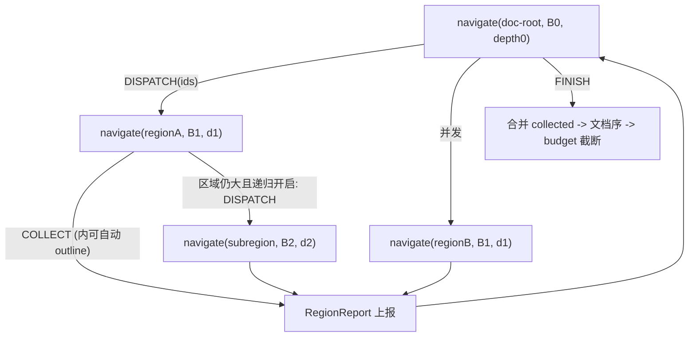

# 递归分派 MAP 导航重构

## 参照:KNOWHERE action space(已核实,仅借鉴渲染)
[actions.py](/Users/wuchengke/Desktop/knowhere/knowhereapi-main/packages/shared-python/shared/services/retrieval/agentic/navigation/actions.py):树观测(缩进 + 每行挂 `actions:` + 内联 summary)、`COLLECT` 对每个可见节点都发(无 top-K)、三通道=discovery 的 `D*` rescue。**只借鉴它的树渲染与"人人可选/rescue"**;它的 `EXPAND/BACK` 是旧的"两层两层往下看"模式,**本方案不采用**——用递归 DISPATCH 取代导航。

## 核心模型:一个递归函数

只有一个过程,外层 agent 与所有 subagent 都是它在不同 scope/depth 上的调用:

```text
navigate(scope, budget, depth) -> RegionReport:
    观测 = 折叠标题图(scope)         # 全貌(标题[+子域内联summary]) 超 budget 才折叠, rescue [Hit] 点亮, 人人可选
    loop (<= max_steps):
        action = LLM(观测 + 已收 + 子报告)
        COLLECT(ids)               -> 收证据(内部可按关键词自动走 outline); 这些枝从图移除
        DISPATCH(ids)              -> 对每个 id 并发调 navigate(id, budget', depth+1); 汇总子报告
        FINISH                     -> 结束
    return RegionReport(collected, suggestions, summary, reason)
```

- **没有 EXPAND/JUMP/PEEK/BACK**。"进入"只有一种方式:`DISPATCH` 把子区域交给下一层 navigate。因为每层默认看得到本区域全貌,不需要"走过去看"。
- **区域小**(标题+summary 在 budget 内)→ ids 少,LLM 就是你说的"是否收/是否再拆"的简单判断。
- **区域大**(超 budget)→ 折叠成标题图,DISPATCH 子区域(递归 = 折叠)。
- 反复跳/自跳/dead-end/死循环:**无导航 + 步数上限 + 已收即移除**,结构上不可能。



## 递归开关(实验期关键)
`config.enable_recursive_dispatch`(默认 **关**):
- **关(先跑这个)**:只有 `depth==0`(根)能 `DISPATCH`。被派到的区域内 **不再 DISPATCH**,一次性对其(可见子集)`COLLECT`;若区域全貌超上下文/报错 → **跳过该区域并记 `reason`**,不阻塞。
- **开**:按阈值递归——区域全貌 > `map_char_limit`(复用 5000)则折叠 + 允许 DISPATCH;`max_dispatch_depth=3`;每层 budget 递减。
- 递归逻辑**完整实现**,仅用开关控制是否展开,便于随时切换对比。

## 改动点

### 1) 统一动作 + 树观测
[src/nav/nav_types.py](src/nav/nav_types.py) `ActionKind`:改为 `COLLECT` / `DISPATCH` / `FINISH`(移除 `EXPAND/JUMP_TO/PEEK/PEEK_CONTENT/BACK` 在新循环中的使用)。
[src/nav/nav_actions.py](src/nav/nav_actions.py) 新增 `_build_navigate_legal_actions`:
- 遍历 `projection.tree_sections` 每个未隐藏节点,用 `map_id` 发 `COLLECT` 与 `DISPATCH`(depth==0 或递归开启时;叶子无 DISPATCH)。**无 top-K**。
- 全局动作只有 `FINISH`。
- 渲染对齐 KNOWHERE 树:缩进、`[Nk] title (counts)[Leaf][Hit] actions: collect=Cx, dispatch=Dx`;root 纯标题,子域(depth>0)内联 summary。
- 删除现 `_build_map_legal_actions` 的 top-K/JUMP/PEEK/EXPAND(第 153-372 行)。

### 2) 递归 navigate 模块
新增 [src/nav/nav_navigate.py](src/nav/nav_navigate.py):
- `navigate(ts, *, scope, query, budget, depth, config, state) -> RegionReport`:`build_projection(scope)`(折叠标题+summary)+ `_build_navigate_legal_actions` + LLM 循环(步数上限 `navigate_max_steps`)。
- `COLLECT` → 复用 [nav_agent.py](src/nav/nav_agent.py) `_collect_subtree` + 合并后的 `collected_section_ids`(内部可走关键词自动 outline,见下)。
- `DISPATCH(ids)` → 见 3);`FINISH` → 返回 `RegionReport{scope, collected, suggestions, summary, reason}`。
- depth0 的 navigate 就是顶层 agent(见 5)。

### 3) 并发 DISPATCH
[src/nav/nav_navigate.py](src/nav/nav_navigate.py) `dispatch(ts, state, ids, *, query, budget, depth, config)`:
- 按 `dispatch_group_size`(默认 5)分组,`ThreadPoolExecutor(max_workers=dispatch_max_workers)` 并发跑 `navigate(id, budget', depth+1)`;单个失败/超限 → 跳过并记 reason,不影响其他。
- 递归关闭时:子调用不再 DISPATCH(actions 里不发 Dx),仅 COLLECT/FINISH。
- 汇总各 `RegionReport` 写入 `state.reports_context`(固定格式);子层 collected 并入 `state.collected_section_ids`,对应枝从上层图移除。
- 复用 [llm_api_cache.py](src/realdata/agent_delivery/code/llm_api_cache.py) `cached_chat_completion` + [section_summary_store.py](src/nav/section_summary_store.py) `get_summary`。配置:`dispatch_group_size=5`、`dispatch_max_workers`、`navigate_max_steps`、`subagent_model_env`、`enable_recursive_dispatch`、`max_dispatch_depth=3`。

### 4) 合并 covered → collected(清理)
`covered` 只在成功 COLLECT 时写入且 = `sid ∪ 后代`;「covered 未 collected」只出现在被父连带盖住的后代。合并为一:
- 语义:`collected_section_ids` = 「已收完、从图移除」= COLLECT 的 `sid` ∪ 全部后代。
- [nav_agent.py](src/nav/nav_agent.py) `_update_collect_coverage`(第 449-490 行)只更新 `collected_section_ids`;删除 `covered_section_ids` 字段([nav_types.py](src/nav/nav_types.py) 第 196 行)及所有读写。
- [nav_projection.py](src/nav/nav_projection.py) `_build_map_tree`(第 296-309 行)只认 `collected`/`dismissed` 整枝删除;去掉「collected but not covered」遗留分支。
- 提示词 Agent State「Evidence collected」只列**主动点过的根**(来自 `action_history`),不列后代;图移除仍靠完整 `collected_section_ids`。
- 所有 `covered_sids` 判断改 `collected_sids`。

### 5) OUTLINE:实验保持关键词自动触发(不暴露给 agent)
现状([nav_agent.py](src/nav/nav_agent.py) `_is_scope_outline_query` 第 165-177 行 + `_collect_subtree` 第 423-430 行):
- 仅当 `task_type ∈ {scope_collection, regulatory_coverage}` 且 query 命中关键词(`主要条目/内容/...`、`列举...部分`、`哪些...部分` 等)时,COLLECT 自动走 `_scope_collect_outline`(对各直接子节取首 N 行,广度优先)。
- 由 `NAV_SCOPE_OUTLINE_MODE` 环境变量开关(默认开)。

**实验期保持这套不变**:agent 只选 `COLLECT(ids)`,不暴露 outline 动作;是否 outline 仍由关键词自动决定。

TODO(knowhere-align): KNOWHERE 用 `query_intent`(如 `MACRO_SUMMARY` / `STRUCTURE_OVERVIEW`)决定 `hydrate_mode=outline`,且可把 outline 升为显式 COLLECT 变体(见 [navigation/tools.py](/Users/wuchengke/Desktop/knowhere/knowhereapi-main/packages/shared-python/shared/services/retrieval/agentic/navigation/tools.py) 第 236-256 行)。迁回时替换关键词启发为 intent 分类,并可选择把 outline 暴露给 agent。

### 6) 顶层循环
[src/nav/nav_agent.py](src/nav/nav_agent.py) `run_nav_episode` 重写:去掉 scope 栈/push_scope/back/JUMP/PEEK/EXPAND 分支(第 877-938 行);顶层 = `navigate(scope=doc-root, depth=0)`;收尾做证据合并(见 8)。

### 7) rescue + 预算隐藏(保留)
[nav_projection.py](src/nav/nav_projection.py) `build_map` 的 `_apply_budget_hide` + highlights `must_keep`(第 432-450 行)原样保留:每层折叠都复用它,rescue 高分节点 `[Hit]` 点亮。[nav_map_scores.py](src/nav/nav_map_scores.py) `select_map_highlights` 不变。

### 8) 最终证据:文档序 + 预算
[nav_agent.py](src/nav/nav_agent.py) 收尾:合并各层 collected,按 `section_id` 去重,按**文档行序**(`_node_to_doc_line`/line id)排序,交 `fill` 按 `budget_chars` 截断(第 1003-1021 行)。

### 9) 提示词
[nav_policy.py](src/nav/nav_policy.py):统一 `_system_prompt`——你面对(可能折叠的)标题图,动作只有 `COLLECT(ids)` / `DISPATCH(ids)`(把子区域交给探索,读回报告) / `FINISH`;大区域应 DISPATCH 而非硬收全树;根据图与子报告决策。`_normalize_id_list` 用于 COLLECT/DISPATCH。

### 10) 空 FINISH 护栏
`len(state.collected)==0` 且剩余步数>2 时不发 `FINISH`(与 [nav_policy.py](src/nav/nav_policy.py) `_pick_fallback` 第 29-31 行一致)。

### 11) 测试
[tests/test_map_nav.py](tests/test_map_nav.py):
- 每个未隐藏节点都带 collect/(dispatch);无 `actions: none`。
- DISPATCH(ids) → 并发子 navigate(mock LLM)→ 报告并入 reports_context、子层证据并入 state、枝从图移除。
- COLLECT;关键词触发的 outline 路径仍生效;最终证据文档序;空 FINISH 屏蔽。
- 递归开关:关时深层无 Dx、区域一次性硬收/超限跳过;开时超阈值折叠 + 递归(scope_0030 的 L92→L93-L99 收全)。
- COLLECT 父节点后父+后代都在 `collected_section_ids` 且从图消失;无 `covered` 残留。

## 与旧计划的关系
取代 [jump_peek_back_fixes_c742d8a6.plan.md](.cursor/plans/jump_peek_back_fixes_c742d8a6.plan.md) 及本文件早前的 OPEN/EXPAND-subagent 版本。no-self-jump / dead-end / auto-peek / 父域锚定 / EXPAND 等因"无导航 + 递归分派"被结构性消解,仅保留空 FINISH 护栏。

## 明确不做
- 不做单 agent 退化开关(论文可比性后续再议);但 `enable_recursive_dispatch` 提供"仅根派发"实验模式。
- 不改 gold 行级切树 / 三通道 / dense / 最终 budget 打包器本身(只加文档序)。
- 每层步数/递归深度有界以控成本(`navigate_max_steps`、`max_dispatch_depth`)。
- 实验期不把 OUTLINE 暴露为 agent 动作(保持关键词自动触发)。
- 本论文实验不做 SEARCH 图表(images/tables)。
  - TODO(knowhere-align): KNOWHERE 外层/内层都有 `SEARCH_IMAGES` / `SEARCH_TABLES`(见 [actions.py](/Users/wuchengke/Desktop/knowhere/knowhereapi-main/packages/shared-python/shared/services/retrieval/agentic/navigation/actions.py) 第 20-21、199-224 行)。迁回时在 navigate 的 legal actions 补回并接 `total_images`/`total_tables` 与 budget 门控。
  - TODO(knowhere-align): OUTLINE 迁回时用 `query_intent` 替换关键词启发,并可升为显式 COLLECT 变体(见上第 5 节)。
